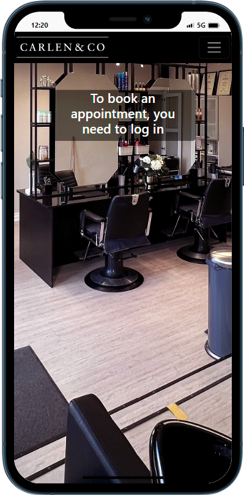
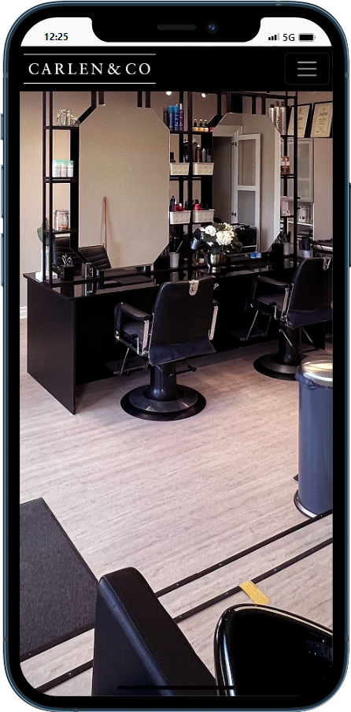
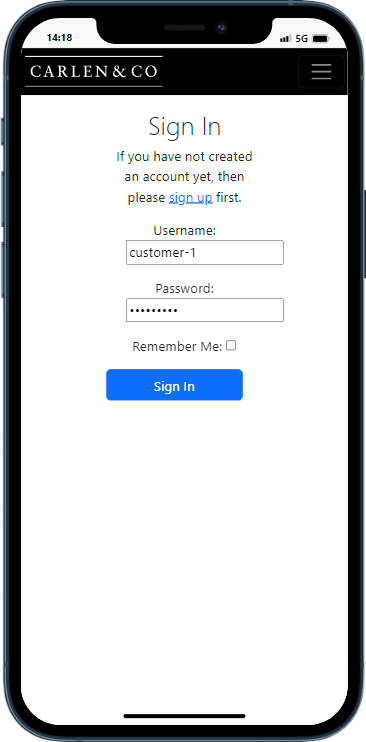
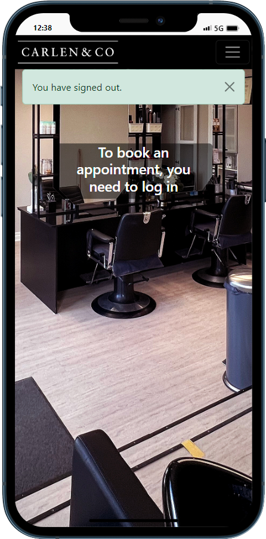
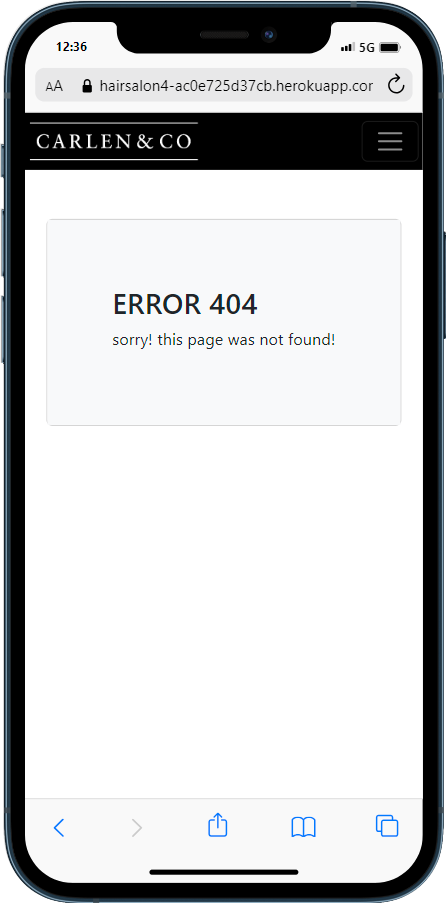

# Hair Salon Booking System

## Purpose
The Booking System is a web application designed to streamline the process of scheduling and managing appointments for a beauty salon.   The application allows customers to view available time slots for different services provided by stylists and book appointments online.

The Booking System is intended to be used by Carlen & CO:s customers.   Stylists can be managed through Django's admin interface,   while customers can register and log in to book their preferred time slots for various beauty services.

With this application, both salon owners and customers can enjoy a hassle-free appointment scheduling experience,   enhancing the overall efficiency and convenience of the booking process.

## Features
### Existing Features

1. **Home Page And Navigation:**   An landing page providing an overview of the hair salon.   Non-logged-in users will be presented with a message. The navigation bar will follow the user to other pages.
  -    
        
        

2. **About Page:**   A dedicated page containing detailed information about the salon, its history, team, and philosophy.
  -    

3. **User Authentication:**   The application offers user registration and login functionalities using Django's built-in authentication system. When signed in the user will have access to the booking system.
  -    
        

4. **Booking Appointments:**   Customers can book appointments for specific time slots by selecting the desired slot from a dropdown list. However, they are prevented from booking more than one slot on a specific day.
  -    

5. **Edit and Delete Appointments:**   Customers can edit and delete their booked appointments as needed, subject to permission checks to ensure only the original customer can modify the booking.
  -    
        
        

6. **Confirmation Messages:**   The application provides confirmation messages and error messages to guide users through the booking process and notify them of successful or failed actions.
  -    
        
        

7. **Responsive Design:** The frontend templates are designed using Bootstrap, making the application mobile-friendly and accessible across different devices.
 
8. **Custom Error Pages:**   Custom error views are implemented to display user-friendly messages for 404 Not Found and 500 Server Error pages.
-    

### Future Features

1. - **Separate Schedules For Each Hairdresser**

2. - **Manager View**

3. - **Employee View**

## User Stories And Testing

### Closed

- #### [Welcome/About Page](https://github.com/Stojj2/Portfolio-Project-4/issues/10)
   - As a **user** I can **get basic information about the salon without login in** so that **I am aware of open times and location**

- #### [Account Registration](https://github.com/Stojj2/Portfolio-Project-4/issues/9)
  - As a **customer** I can **create a user account** so that **I can book and view my appointments**

- #### [View Available Time Slots](https://github.com/Stojj2/Portfolio-Project-4/issues/6)
  - As a **customer** I can **see available time slots** so that **I can plan my appointment**

- #### [Create Booking](https://github.com/Stojj2/Portfolio-Project-4/issues/1)
  - As a **customer** I can **view the list of available times offered by the salon** so that **I can choose the one that suits my needs.**

- #### [Read Bookings](https://github.com/Stojj2/Portfolio-Project-4/issues/3)
  - As a **customer** I can **see my booked appointments** so that **I have a record of the details.**

- #### [Update Bookings](https://github.com/Stojj2/Portfolio-Project-4/issues/4)
  - As a **customer** I can **update my appointment** so that **I can change it at my convenience.**

- #### [Delete Bookings](https://github.com/Stojj2/Portfolio-Project-4/issues/5)
  - As a **customer** I can **delete my booked appointment** so that **the information will reach the hairdresser**

  

### Open

- #### [Separate Schedules For Each Hairdresser](https://github.com/Stojj2/Portfolio-Project-4/issues/2)
  - As a **customer** I can **see the availability of each hairdresser** so that **I can book an appointment with a specific stylist.**

- #### [Manager View](https://github.com/Stojj2/Portfolio-Project-4/issues/8)
  - As a **manager** I can **edit all employee schedules** so that **I have full control of all the staff and which customers they have on their schedule**

- #### [Employee View](https://github.com/Stojj2/Portfolio-Project-4/issues/7)
  - As a **hairdresser** I can **view and update my customer bookings** so that **I can keep track of my schedule accurately.**

  

### Validator testing

### Bugs

## Data Model

 - **The relationships between the models are as follows:** 
     

1. **User:** This is the built-in Django User model, representing the users of the application. It contains fields like username, email, and password.

2. **Slot:** This model represents the available time slots for appointments. It is related to the User model using a foreign key, as each slot belongs to a specific stylist (user). The model includes fields for date, start time, end time, and a boolean field to indicate whether the slot is reserved or not.

3. **Booked:** This model represents the booked appointments. It includes foreign keys to the Slot and User models, as each booking is associated with a specific slot and user (customer). The model also includes a comment field for additional notes about the booking.

## Testing

 ### Validator testing

  ### Bugs

## Technology 
  - **GitPod**
    - GitPod where used for writing all code 
  - **GitHub**
    - For storing the code GitHub where used
  - **Django**
    - For a fullstack framework
  - **Bootstrap**
    - For design and styling
 - **ElephantSQL**
    - For running a PostgreSQL database
 - **Cloudinary**
    - For storing media assets in the cloud.      
  - **Heruko**
    - Heruko was use to deploy the app
  - **Mobile FIRST**
    - Mobile First Chrome extension where used for screenshots
    
## Deployment
### Heroku
This project was deployed to Heroku.
  - Steps for deployment:
    - Fork or clone this repository
    - Create a new heruko app
    - Go to settings and set up the "Config Vars" 
    - Link the Heruko app to the repository 
    - Click **Deploy**
    
 ### GitPod
 The entire coding process was carried out using the cloud-based IDE GitPod.
  - The app was coded using GitPod. The steps to deploy is as following:
  - In the GitHub repository, press the green GitPod button for transfer the project to GitPod enviroment
    - NOTE!
      - [GitPod webbrowser plugin](https://chrome.google.com/webstore/detail/gitpod-always-ready-to-co/dodmmooeoklaejobgleioelladacbeki) To access this button, it is necessary to install this plugin on your browser.

## Credits

